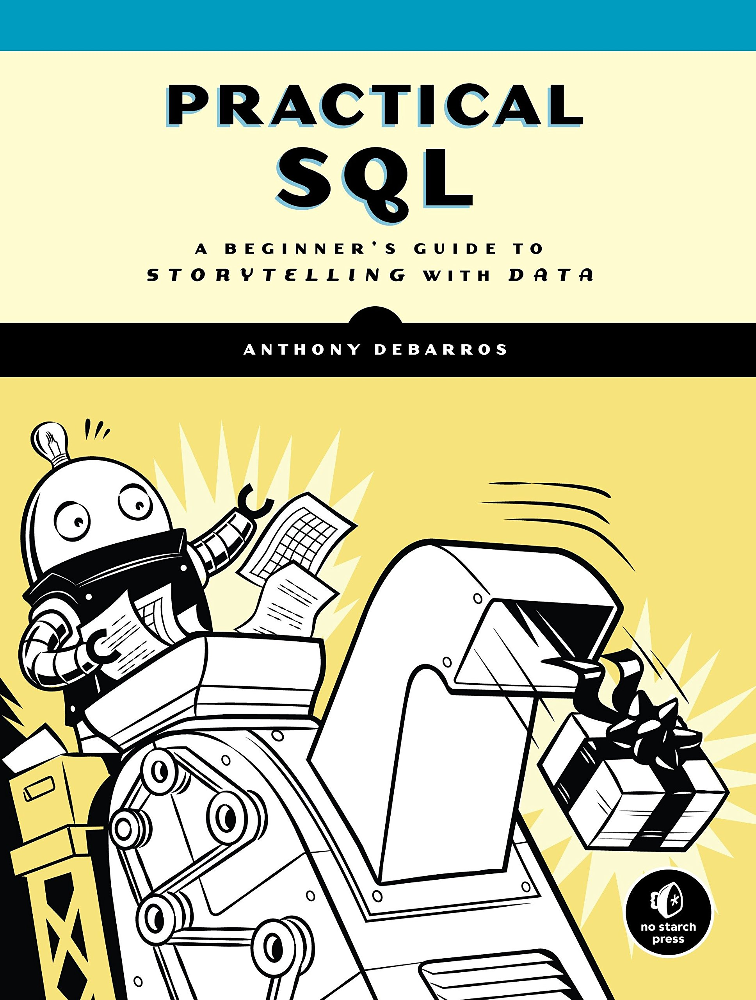

Practical-SQL exercises
================

My solutions to exercises from the *Practical SQL* (1st Edition) book.

## Links

Solutions:
<https://github.com/IndrajeetPatil/Practical-SQL-exercises/tree/master/exercises>

Book: <https://nostarch.com/practicalSQL>

## See also

-   1st Edition Code and Data:
    <https://github.com/anthonydb/practical-sql>

-   2nd Edition Code and Data:
    <https://github.com/anthonydb/practical-sql-2>

-   <https://dba.stackexchange.com/questions/201646/slow-connect-time-to-postgresql-on-windows-10>
